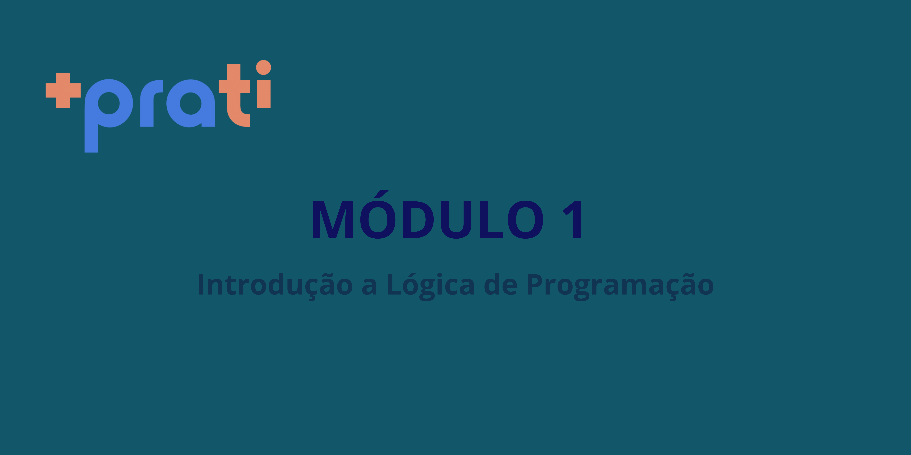

&nbsp;&nbsp;&nbsp;O primeiro módulo do curso Desenvolvimento FullStack da +praTI é voltado para a discussão dos **fundamentos da programação** e construção da **lógica de programação**.<br>
## Tecnologias Utilizadas
* JavaScript
## Instalações
&nbsp;&nbsp;&nbsp;Para a escrita e execução dos códigos organizados nas pastas */aulas* e */exercicios* optou-se pelo **Visual Studio Code** como editor de código e o **Node.js** como ambiente de execução.

### Visual Studio Code
&nbsp;&nbsp;&nbsp;O Visual Studio Code (VS Code) é um editor de códigos gratuito disponível para os sistemas operacionais Windows, macOS e Linux. 
Instruções completas para a instalação do VS Code nos sistemas operacionais citados estão disponíveis no link abaixo:

https://code.visualstudio.com/download

&nbsp;&nbsp;&nbsp;Recomenda-se fortemente a instalação da extensão **Code Runner** em seu VS Code. Essa extensão permite a **rápida execução de trechos ou arquivos inteiros de códigos** em diferentes linguagens de programação a partir do VS code. 
Para instalação dessa e de outros extensões basta buscar pela guia *Extensions* do lado esquerdo da tela do VS Code e inserir o nome da extensão desejada na barra de pesquisa. 

&nbsp;&nbsp;&nbsp;A documentação referente ao VS Code pode ser obtido através do seguinte link:

https://code.visualstudio.com/docs#vscode

### Node.js
&nbsp;&nbsp;&nbsp;O Node.js foi idealizado como uma **plataforma de execução para o JavaScript** gratuita e open-source que **permite aos desenvolvedores criar os mais diversos tipos de funcionalidades com o JavaScript fora de um navegador**. 
Aqui utilizamos o Node.js apenas como ambiente de execução do JavaScript em terminal.

&nbsp;&nbsp;&nbsp;A instalação do Node.js pode ser feita de diversas maneiras e abrange os mais famosos sistemas operacionais, isto é Windows, macOS e Linux. O link abaixo relaciona as diferentes maneiras para a instalação do Node.js em sua versão mais atualizada em cada sistema operacional:

https://nodejs.org/en/download/package-manager

&nbsp;&nbsp;&nbsp;Para que as operações de entrada de dados por usuários sejam possíveis direto no terminal, existe um módulo do Node.js chamado Prompt-Sync. Nos códigos desenvolvidos aqui, quando é interessante considerar entradas de dados por usuários, utilizamos o Prompt-Sync.

&nbsp;&nbsp;&nbsp;A instalação do Prompt-Sync é feita através do gerenciador de pacotes NPM. O comando para instalação é colocado no terminal e basta instalá-lo apenas uma vez.

```sh
npm install prompt-sync
```
&nbsp;&nbsp;&nbsp;Para utilização das dependências do Prompt-Sync é preciso instanciar um objeto para entrada de dados da seguinte maneira:

```js
const input = require(`prompt-sync`)(); 
// objeto input criado.

let teste = input(`Digite aqui o seu nome: `); 
// utilização do objeto input para entrada de dados.
```

&nbsp;&nbsp;&nbsp;Informações mais completas sobre o Node.js e suas possibilidades podem ser encontrada no seguinte link:

https://nodejs.org/docs/latest/api/

## Organização dos Códigos
&nbsp;&nbsp;&nbsp;Os códigos desenvolvidos nesse primeiro módulo estão dividos em atividades feitas em aula e atividades de cunho avaliativo, pasta */aulas* e */exercicios* respectivamente.

## Temáticas das Aulas

&nbsp;&nbsp;&nbsp;Os assuntos cobertos pelas aulas deste primeiro módulo estão especificados abaixo, bem como o número de tarefas avaliativas:

* Fundamentos da Computação 
* Introdução a lógica de Programação e JavaScript Básico 
* Estruturas de Controle: Repetição
* Tarefa 1 -> Lista de exercícios: Praticando JS básico
* Arrays e Funções básicas 
* Funções Avançadas e Escopo de Variáveis
* Objetos em JavaScript 
* Tarefa 2-> Lista de exercícios -> Praticando Lógica de Programação com JS
* Revisão e Projeto Final do Módulo 

## Conclusão
Este primeiro módulo tem como foco apresentar novos conceitos para iniciantes no campo da computação e programação, bem como ferramentas importantes no dia-a-dia de um desenvolvedor.

